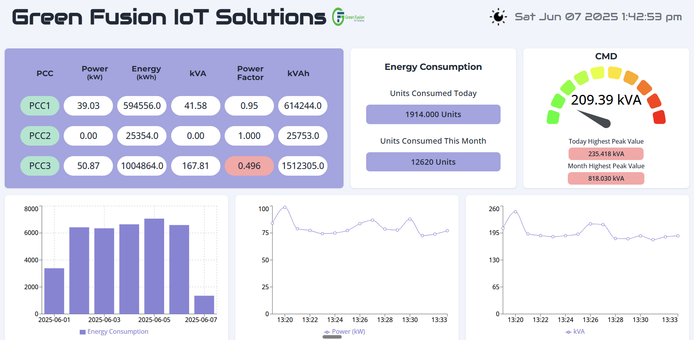
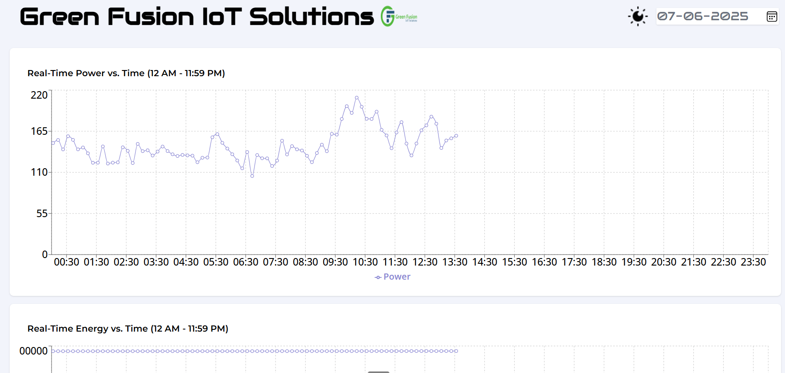
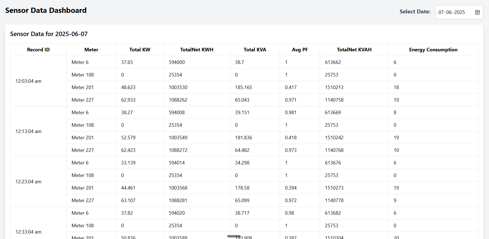

# Vishnu Energy Management System (VCEMS)

A real-time energy monitoring and management system built with React and Vite. This application provides comprehensive monitoring of power consumption across multiple Power Control Centers (PCCs) with real-time data visualization and alerts.

## Features

- Real-time monitoring of power metrics (kW, kWh, kVA, Power Factor)
- Multiple PCC monitoring (PCC1, PCC2, PCC3)
- Interactive data visualization with charts and gauges
- Real-time alerts for energy limit exceedance
- Dark/Light theme support
- Responsive design for all devices
- Historical data analysis
- Energy consumption predictions

## Technologies Used

- **Frontend Framework**: React 18.3.1
- **Build Tool**: Vite
- **Styling**: Tailwind CSS
- **Routing**: React Router DOM
- **HTTP Client**: Axios
- **Data Visualization**: 
  - Recharts
  - React Gauge Chart
  - React Slick
- **UI Components**: RSuite
- **Notifications**: React Toastify
- **Date Handling**: Moment.js

## Prerequisites

- Node.js (v14.0.0 or higher)
- npm (v6.0.0 or higher)

## Setup Instructions

1. Clone the repository:
   ```bash
   git clone https://github.com/suryanaidu048/VCEMS-CLIENT.git
   cd vems-client
   ```

2. Install dependencies:
   ```bash
   npm install
   ```

3. Create a `.env` file in the root directory and add your environment variables:
   ```
   VITE_API_URL=your_api_url
   VITE_API_URL2=your_secondary_api_url
   ```

4. Start the development server:
   ```bash
   npm run dev
   ```

5. Build for production:
   ```bash
   npm run build
   ```

## Project Structure

```
src/
├── components/     # Reusable UI components
├── pages/         # Main page components
├── data/          # Data and API configurations
├── constants/     # Constant values and assets
├── App.jsx        # Main application component
└── main.jsx       # Application entry point
```

## Dashboard Screenshots

### Main Dashboard

*Real-time monitoring of power metrics across multiple PCCs*

### Energy Consumption Analysis

*Detailed energy consumption analysis with historical data*

### Power Factor Monitoring

*Power factor monitoring with real-time alerts*

## Contributing

1. Fork the repository
2. Create your feature branch (`git checkout -b feature/AmazingFeature`)
3. Commit your changes (`git commit -m 'Add some AmazingFeature'`)
4. Push to the branch (`git push origin feature/AmazingFeature`)
5. Open a Pull Request

## License

This project is licensed under the MIT License - see the LICENSE file for details.

## Support

For support, email [support@example.com] or create an issue in the repository.
